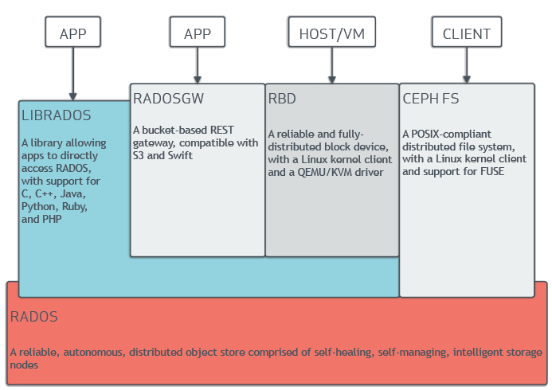
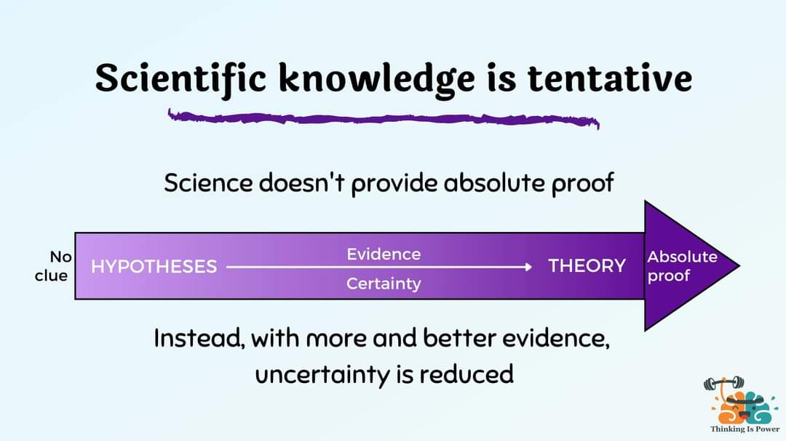

+++
title = "Build a datacenter"
description = "A distributed knowledge encapsulation system based on Functional Reactive Programming and Event Sourcing"
date = 2022-09-01
weight = 0
draft = false
in_search_index = true
template = "page.html"
[taxonomies]
  tags = ["cim", "composable", "dcim", "rust"]
  people = ["steele"]

# Your own data.
[extra]
image = "/img/dots.jpg"

+++
# Build the datacenter

We are bonding ceph with event store and projections to ipfs and other clients 
https://youtu.be/7I9uxoEhUdY

- ipfs talks to the public internet,
- ceph is the internal storage strategy,
- event store tells you what is there and how it got there.

- ceph is low level storage it talks to hardware 
- ipfs talks to the web 
- event store says what is there 
- authentik protects it from outsiders
​
### We combine lots of different ideas to arrive at a [composable information machine](/library/cim).

none of ceph or ipfs are typed... we add type systems and apis to more than just the Ansible Playbooks, we link NetBox, n8n Automation, [and more](/tools)

    

  - IPFS is another CLIENT
  - RBD is ONLY about blocks in RADOS
  - Event Store is MetaData about stuff INSIDE the blocks
  - We tell CEPH to do some specific things for us to enable a better IPFS or any other Client. A Client could be SOLID or some Future way or sharing info
  - ceph is for us... it's absolutely NOT public on our public side, this is how we talk to things inside a rack/datacenter/tenant. It helps us to partition information more wisely. 
  - The blocks in IPFS are a BLOCK storage device inside CEPH

45 Drives can tell you how to build a STORAGE system... they tell you nothing about the information within the system.

We are the processes sitting on top of this stuff.
and you don't need to learn this hardware stuff to use it.
 Mostly you need to learn the Idea behind [n8n](/library/n8n) and how we will be using it and acceptance tests to create business process.

we need to talk a lot about business process, agile and the 'cone of uncertainty'. 
> This is what we directly attack, chaos and uncertainty.

[Building from Nothing](/articles/build-from-nothing.md)
